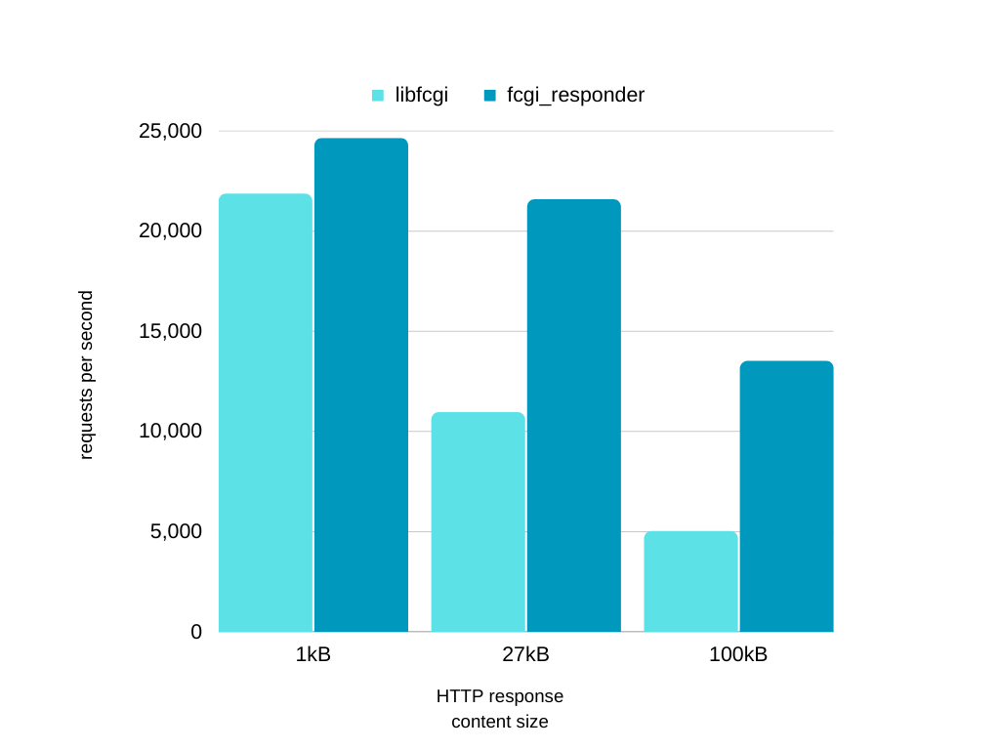

[](https://github.com/kamchatka-volcano/fcgi_responder/actions/workflows/build_and_test.yml)

`fcgi_responder` is a C++17 library that implements the [Responder role](https://fast-cgi.github.io/spec#62-responder) of the FastCGI protocol. It processes the raw data received from the web server and returns serialized output that needs to be sent back to the server by the client code. The library does not handle the implementation of the connection to the web server, so clients can use whatever socket programming methods they prefer. This makes `fcgi_responder` portable and free of external dependencies.

`fcgi_responder` aims to be a modern and readable implementation of the FastCGI protocol. Our benchmark using the `asio` library shows more than 100% increase in performance compared to the popular FastCGI implementation `libfcgi`, which is written in C.

<p align="center">
    
</p>

## Showcase
* [asyncgi](https://github.com/kamchatka-volcano/asyncgi/) - a web framework based on `fcgi_responder` and `Asio`

## Usage
### Processing requests from the web server
To use the `fcgi_responder` library, inherit from the `fcgi::Responder` class and implement its pure virtual methods to provide the necessary functionality:

* `virtual void sendData(const std::string& data) = 0`
* `virtual void processRequest(fcgi::Request&& request, fcgi::Response&& response) = 0`
* `virtual void disconnect() = 0`

Then, listen for connections from the web server and process the incoming data by passing it to the `fcgi::Responder::receiveData` method.

This is a minimal example that uses the standalone asio library for networking:
```C++
#include "asio.hpp"
#include <fcgi_responder/responder.h>
#include <iostream>

using unixdomain = asio::local::stream_protocol;

class Connection : public fcgi::Responder{
public:
    explicit Connection(unixdomain::socket&& socket)
    : socket_(std::move(socket))
    {
    }

    void process()
    {
        while(isOpened_){
            try {
                auto receivedDataSize = socket_.read_some(asio::buffer(buffer_));
                ///
                /// Passing read socket data with fcgi::Responder::receiveData method
                ///
                receiveData(buffer_.data(), receivedDataSize);
            }
            catch(...){
                isOpened_ = false;
                return;
            }
        }
    }

private:
    ///
    /// Overriding fcgi::Responder::sendData to send response data to the web server
    ///
    void sendData(const std::string& data) override
    {
        asio::write(socket_, asio::buffer(data, data.size()));
    }

    ///
    /// Overriding fcgi::Responder::disconnect to close connection with the web server
    ///
    void disconnect() override
    {
        try{
            socket_.shutdown(unixdomain::socket::shutdown_both);
            socket_.close();
        }
        catch(const std::system_error& e){
            std::cerr << "socket close error:" << e.code();
        }
        isOpened_ = false;
    };

    ///
    /// Overriding fcgi::Responder::processRequest to form response data
    ///
    void processRequest(fcgi::Request&&, fcgi::Response&& response) override
    {
        response.setData("Status: 200 OK\r\n"
                         "Content-Type: text/html\r\n"
                         "\r\n"
                         "HELLO WORLD USING ASIO!");
        response.send();
    }

private:
    unixdomain::socket socket_;
    std::array<char, 65536> buffer_;
    bool isOpened_ = true;
};

int main ()
{
    auto socketPath = std::string{"/tmp/fcgi.sock"};
    umask(0);
    chmod(socketPath.c_str(), 0777);
    unlink(socketPath.c_str());

    auto io = asio::io_context{};
    auto acceptor = unixdomain::acceptor{io, unixdomain::endpoint{socketPath}};

    while (true) {
        auto socket = acceptor.accept();
        auto connection = Connection{std::move(socket)};
        connection.process();
    }
    return 0;
}
```
Check the `examples` directory for this and other example that uses the Qt framework.

### Sending requests to FastCGI applications
The `fcgi_responder` library provides a `fcgi::Requester` class that can be used to send requests to FastCGI applications.

To use it, inherit from the `fcgi::Requester` class and implement its pure virtual methods:
- `virtual void sendData(const std::string& data) = 0`
- `virtual void disconnect() = 0`

Once you have done that, you can connect the socket to the listening FastCGI application and make a request by calling the `fcgi::Requester::sendRequest` method. Be sure to process incoming data by passing it to the `fcgi::Requester::receiveData` method.


This is a minimal example that uses the standalone asio library for networking:
```C++
#include "asio.hpp"
#include <fcgi_responder/requester.h>
#include <iostream>

using unixdomain = asio::local::stream_protocol;

class Client : public fcgi::Requester{
public:
    explicit Client(unixdomain::socket&& socket)
    : socket_(std::move(socket))
    {
    }

    void process()
    {
        while(isOpened_){
            auto receivedDataSize = socket_.read_some(asio::buffer(buffer_));
            ///
            /// Passing read socket data with fcgi::Requester::receiveData method
            ///
            receiveData(buffer_.data(), receivedDataSize);
        }
    }

private:
    ///
    /// Overriding fcgi::Requester::sendData to send request data to the FastCGI application
    ///
    void sendData(const std::string& data) override
    {
        asio::write(socket_, asio::buffer(data, data.size()));
    }

    ///
    /// Overriding fcgi::Requester::disconnect to close connection with the FastCGI application
    ///
    void disconnect() override
    {
        try{
            socket_.shutdown(unixdomain::socket::shutdown_both);
            socket_.close();
        }
        catch(const std::system_error& e){
            std::cerr << "socket close error:" << e.code();
        }
        isOpened_ = false;
    };

private:
    unixdomain::socket socket_;
    std::array<char, 65536> buffer_;
    bool isOpened_ = true;
};

void onResponseReceived(const std::optional<fcgi::ResponseData>& response)
{
    std::cout << "Response:" << std::endl;
    if (response)
        std::cout << response->data << std::endl;
    else
        std::cout << "No response" << std::endl;
}

int main ()
{
    auto socketPath = std::string{"/tmp/fcgi.sock"};
    auto io = asio::io_context{};
    auto socket = unixdomain::socket{io};
    try {
        socket.connect(unixdomain::endpoint{socketPath});
    }
    catch(std::system_error& e){
        std::cerr << "Socket connection error:" << e.code();
        return 1;
    }

    auto client = Client{std::move(socket)};
    client.setErrorInfoHandler([](const std::string& error){
        std::cout << error << std::endl;
    });
    client.sendRequest({{"REQUEST_METHOD","GET"},
                        {"REMOTE_ADDR","127.0.0.1"},
                        {"HTTP_HOST","localhost"},
                        {"REQUEST_URI","/"}}, {}, onResponseReceived);
    client.process();
    return 0;
}
```

## Installation
Download and link the library from your project's CMakeLists.txt:
```
cmake_minimum_required(VERSION 3.14)

include(FetchContent)

FetchContent_Declare(fcgi_responder
    GIT_REPOSITORY "https://github.com/kamchatka-volcano/fcgi_responder.git"
    GIT_TAG "origin/master"
)
#uncomment if you need to install fcgi_responder with your target
#set(INSTALL_FCGI_RESPONDER ON)
FetchContent_MakeAvailable(fcgi_responder)

add_executable(${PROJECT_NAME})
target_link_libraries(${PROJECT_NAME} PRIVATE fcgi_responder::fcgi_responder)
```

To install the library system-wide, use the following commands:
```
git clone https://github.com/kamchatka-volcano/fcgi_responder.git
cd fcgi_responder
cmake -S . -B build
cmake --build build
cmake --install build
```

After installation, you can use the find_package() command to make the installed library available inside your project:
```
find_package(fcgi_responder 1.0.0 REQUIRED)
target_link_libraries(${PROJECT_NAME} PRIVATE fcgi_responder::fcgi_responder)
```

## Running tests
```
cd fcgi_responder
cmake -S . -B build -DENABLE_TESTS=ON
cmake --build build 
cd build/tests && ctest
```

## Running fuzzing tests
`fcgi_responder` is tested with the `AFL++` fuzzing testing tool. This repository contains fuzzing input data in `fuzz_test/input`, a fuzzing harness `fcgi_responder_fuzzer` and a fuzzing input data generator `fuzz_input_generator`.  
To build `fcgi_responder_fuzzer` for debugging input data run the following commands:
```
cd fcgi_responder
cmake -S . -B build -DENABLE_FUZZ_TESTS=ON
cmake --build build
```

To build `fcgi_responder_fuzzer` for running fuzzing tests with `afl-fuzz` utility run the following commands:
```
cd fcgi_responder
LLVM_CONFIG="llvm-config-11" CXX=afl-clang-fast++ cmake -S . -B afl_build -DENABLE_FUZZ_TESTS=ON
cmake --build afl_build
```
Adjust the `LLVM_CONFIG` variable to point to the version of LLVM you want to use.

To run fuzzing tests with the `afl-fuzz` utility run the following command:
```
afl-fuzz -i ./fuzz_tests/input -o ./fuzz_tests/res  -x ./fuzz_tests/afl_dict.txt -s 111 -- ./afl_build/fuzz_tests/fcgi_responder_fuzzer @@
```

The results of the fuzzing tests can be found in the `fuzz_tests/res` directory.

To learn more about fuzzing testing, check out the [AFL++ docs](https://github.com/AFLplusplus/AFLplusplus/tree/stable/docs) and this [tutorial](https://github.com/antonio-morales/Fuzzing101/).

The input data inside `/fuzz_tests/input` is generated by the `fuzz_input_generator` utility. It is a modified version of the unit tests that writes input data to files. To build it, use the following commands:
```
cd fcgi_responder
cmake -S . -B build -DENABLE_FUZZ_INPUT_GENERATOR=ON
cmake --build build
```


## Running examples
Set up your webserver to use the FastCGI protocol over unix domain socket `/tmp/fcgi.sock`. With NGINX you can use this config:

```
server {
	listen 8088;
	server_name localhost;
	index /~;

	location / {
		try_files $uri $uri/ @fcgi;
	}
	
	location @fcgi {
		fastcgi_pass  unix:/tmp/fcgi.sock;
		include fastcgi_params;
		fastcgi_intercept_errors on;
		fastcgi_keep_conn off;
	}
}

```

Build and run asio example:

```
cd fcgi_responder
cmake -S . -B build -DENABLE_ASIO_EXAMPLE=ON -DENABLE_ASIO_REQUESTER_EXAMPLE=ON
cmake --build build 
./build/examples/asio_example
./build/examples/asio_requester_example
```

Or build and run Qt example:

```
cd fcgi_responder
cmake -S . -B build -DENABLE_QT_EXAMPLE=ON -DENABLE_QT_REQUESTER_EXAMPLE=ON
cmake --build build 
./build/examples/qt_example
./build/examples/qt_requester_example
```

Check that it's working here: http://localhost:8088 


## Running benchmarks
Utilities `libfcgi_benchmark` and `fcgi_responder_benchmark` were used to measure performance for the chart in this document. They can be built with the following commands:

```
cd fcgi_responder
cmake -S . -B build -DENABLE_LIBFCGI_BENCHMARK=ON -DENABLE_FCGI_RESPONDER_BENCHMARK=ON
cmake --build build
./build/utils/fcgi_responder_benchmark/fcgi_responder_benchmark --response-size 27
./build/utils/libfcgi_benchmark/libfcgi_benchmark --response-size 27
``` 

The required webserver configuration is the same as in the previous section.

Throughput performance of both benchmarks can be measured with `ab` tool:

```
ab -n 20000 -c 10 http://localhost:8088/
```


### License
**fcgi_responder** is licensed under the [MS-PL license](/LICENSE.md)  


